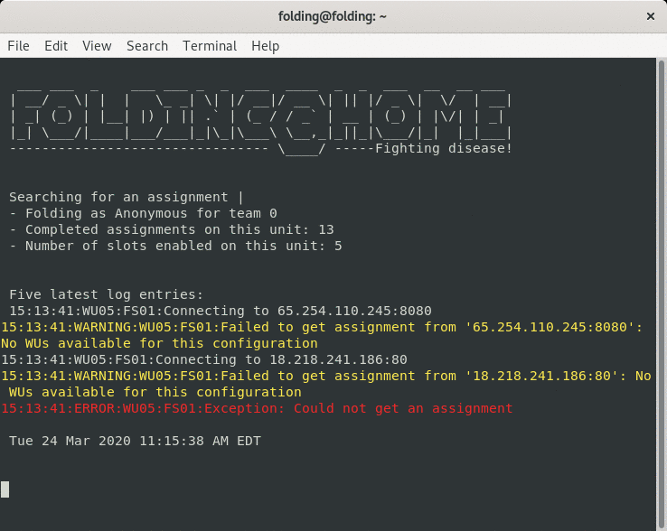
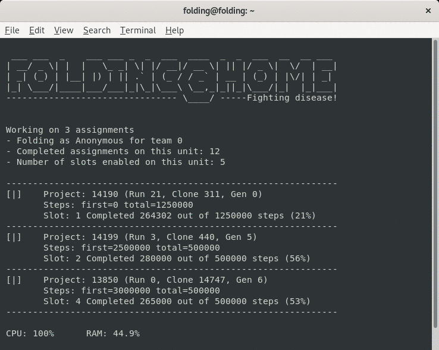

folding
=======
**Silent install and monitoring script for Folding@Home on Debian based systems**

[](LICENSE.md)

## Usage
This is a simple script I put togheter to automatically download and install Folding@Home silently on my virtual instances. Note that this script was written mainly for CPU based folding on Debian based systems, and has therefore only been tested on Debian (buster). But I hope it may be of help to others out there.

### Configuration
The head of the script contains a few configurable variables, such as folding user, team, passkey, autostart, etc. Edit these (alongside the download URLs if there are more recent versions of the packages) <u>before</u> you run the script the first time.

```bash
	# Change these to your own values, if you don't have a username or passkey,
	# get one from here: https://apps.foldingathome.org/getpasskey
	FOLDING_USER=Anonymous # Folding@home User Name. Default: Anonymous
	FOLDING_TEAM=0 # Folding@home Team Number. Default: 0
	FOLDING_PASSKEY='' # Passkey is optional. Default: 
	FOLDING_POWER=medium # System resources to be used initially: light, medium, full. Default: medium
	FOLDING_GPU=false # Find and use GPU automatically. Default: false
	FOLDING_AUTOSTART=true # Should FAHClient be automatically started? Default: true
	FOLDING_ANONYMOUS=false # Set to true if you do not want to fold as a user. Default: true
	FOLDING_SLOTS=0 # Set the number of slots, i.e., simultaneous assignment capacity (0 = automatic). Default: 0
```

### Installation
On the first run, the script will try to determine if the folding@home service exist. If not, the script will continue to download, configure, and silently install the relevant packages. Note that some parts of this script requiers super-user privileges. After the installation is completed, the script will start the progress monitoring.

### Monitoring
If Folding@Home is installed and running, this script will instead jump to the progress monitor each time it is run. The progress monitor will show the current status of your folding assignment(s), folding user and team. Closing it will not affect your folding, since it only monitors the log files.





### Todo
- Notice changes in the script header configuration and update the folding@home configuration accordingly
- Add custom slots and monitoring capacity for GPUs
